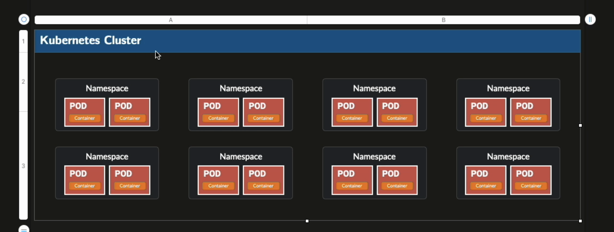

## Namespaces

Namespace is not a physical construct, it is not consuming any resources, but it is a logical construct that allows you to group resources which are conceptually related.

You can give access only to a specific namespace.

