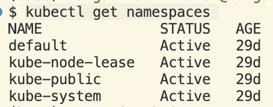

## Namespaces

Namespace is not a physical construct, it is not consuming any resources, but it is a logical construct that allows you to group resources which are conceptually related.

You can give access only to a specific namespace.


While a Kubernetes cluster is physically distributed across multiple machines (master and worker nodes), developers interact with it as a single entity partitioned into logical divisions called namespaces. These namespaces group together closely related resources.

If no namespace is specified, Kubernetes will place the resource in the default namespace.


```
kubectl get namespaces
kubectl get services
kubectl get pods -n <namespace-name>

kubesct create namespace <namespace-name>
kubectl apply -f <path-to-folde/files> -n <namespace-name>
kubectl get pods,services -n <namespace-name>
```

