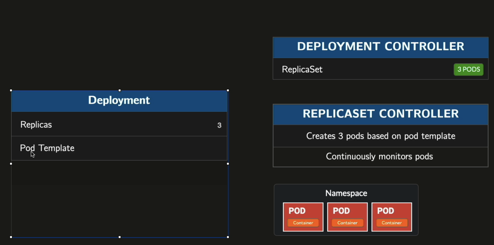
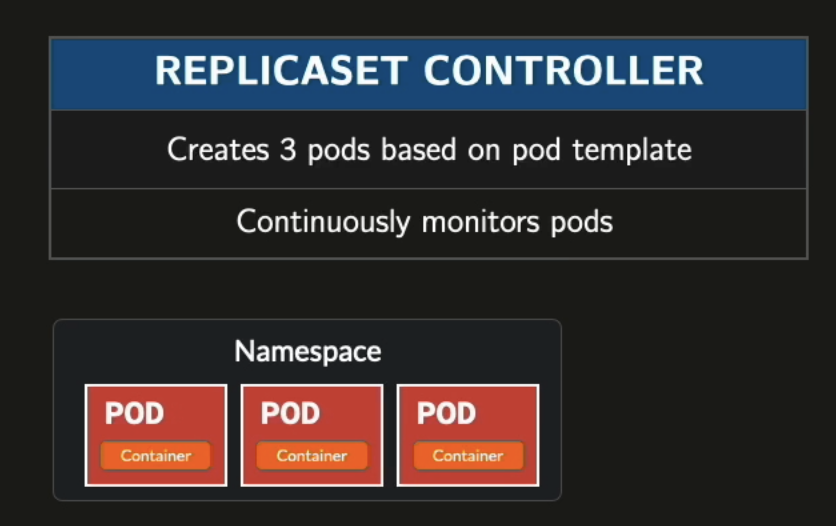
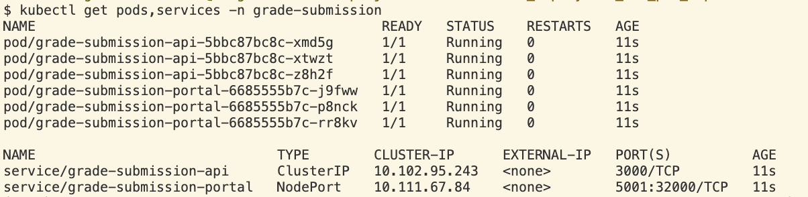
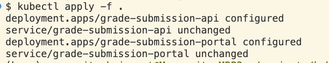
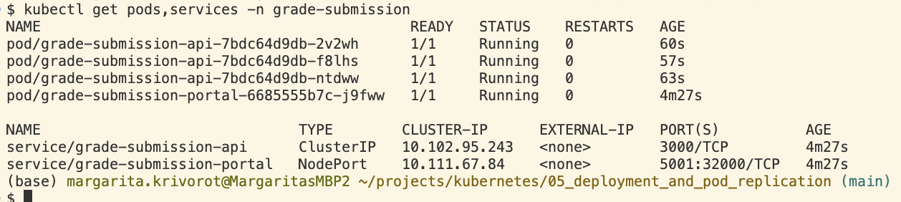

If we define a Deployment, we can specify the number of replicas we want to run and Kubertenes will create the specified number of Pods with identical appication running on them.

If we delete a Pod, Kubernetes will automatically create a new one.




Deployment and ReplicaSet are **Kubernetes objects** — defined in YAML files and submitted to the cluster via `kubectl apply`. The YAML file is just the definition; the object is what lives and runs in the cluster.

## Deployment

A Kubernetes object defined in YAML and submitted to the cluster via `kubectl apply`. A high-level controller that manages ReplicaSets and enables declarative updates (rolling updates, rollbacks). When you update a Deployment (e.g. new image), it creates a new ReplicaSet and gradually shifts traffic to it, keeping the old one for rollback.

A Deployment controller is a control loop running in the control plane that continuously watches the cluster and reconciles actual state to desired state — creating or updating ReplicaSets as needed. "Deployment" and "Deployment controller" refer to the same object; "controller" just emphasizes its behavioral role.

## ReplicaSet

Ensures a specified number of identical pod replicas are running at all times.

A ReplicaSet controller is a control loop running in the control plane that continuously watches the cluster and reconciles actual state to desired state. ReplicaSet watches how many pods matching its label selector are running — if the count doesn't match `replicas`, it creates or deletes pods to compensate.

You rarely create ReplicaSets directly — a Deployment creates and manages them for you.



## Reapplying changes

Deleting pods won't work — the Deployment controller will immediately recreate them. To apply changes to a Deployment, reapply the YAML:

```bash
kubectl apply -f grade-submission-api-deployment.yaml
kubectl apply -f grade-submission-portal-deployment.yaml
```

Kubernetes will perform a rolling update — gradually replacing old pods with new ones, without downtime.

Before modifications:




Modifications application:



Applied: 



## Inspecting Services

Lists all Services in a namespace — shows type, cluster IP, ports, and NodePort:

```bash
kubectl get svc -n grade-submission
```