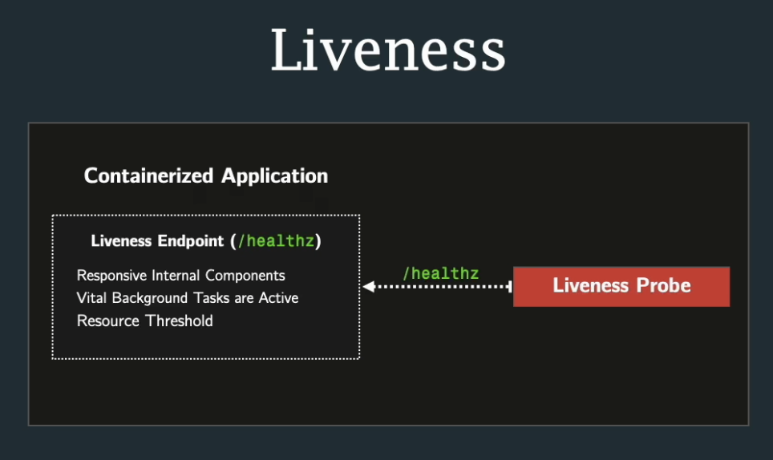
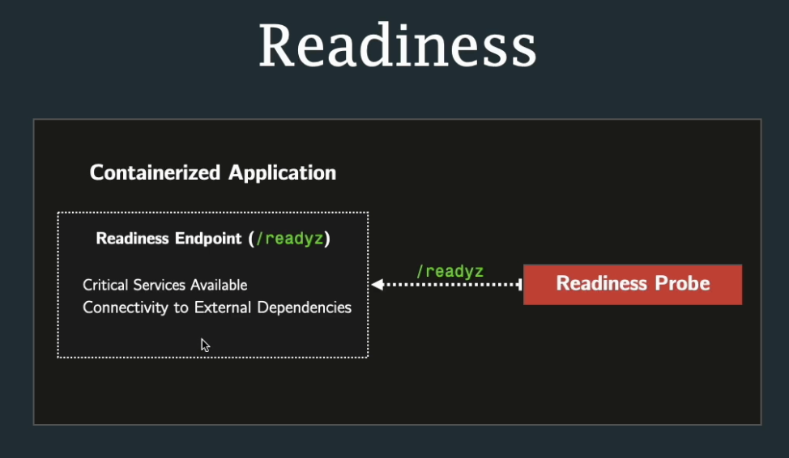

## Liveness Probe

Then application terminates (process is dead) kubertenes will restart it (resurrection, resiliency and self-healing)

But if application is still technically running, consuming resources, etc., but not operational?

Liveness Probe => Restarts the container if the application is not operational.

The liveness endpoint returns a 200 status if the application is operational, or a 500 status if it's not. The liveness probe checks this endpoint and considers the app healthy only if it receives a 200 status.
(Expects 200, any other response, or no response at all, triggers a container restart.)

Interesting that on /healthz we have to really implementinternal checks

## Readiness Probe

The app is operational, but external components are down (DB down, etc.)?
Readiness probe - will continiously check if the app is ready to serve traffic.

The readiness endpoint verifies if the application has successfully connected to all components necessary for serving traffic
If the probe receives anything other than a 200 status, or no response, it keeps the container out of service.

Interesting that on /readyz we have to really implement internal checks too

