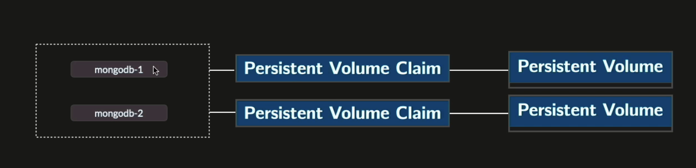
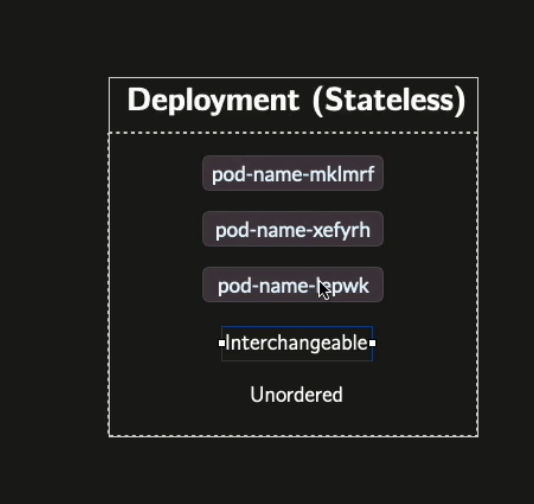
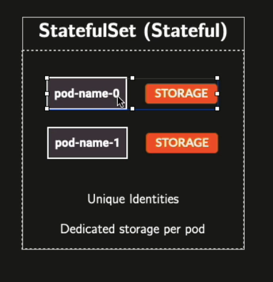
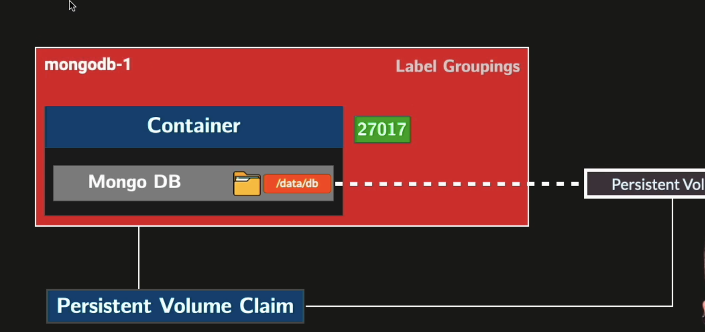
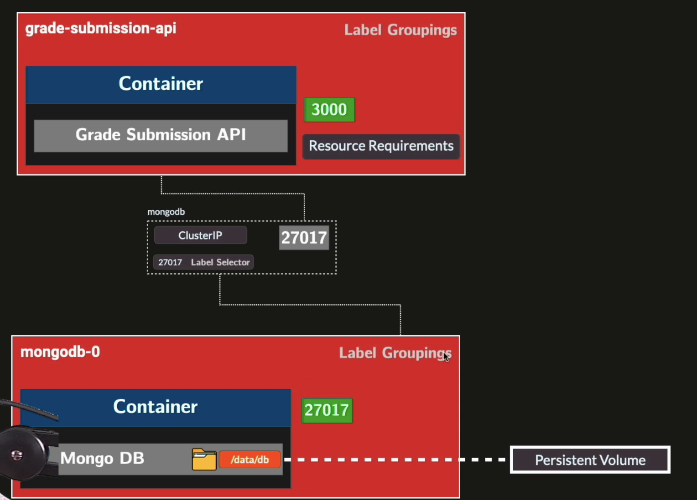

# Storage Orchestration


We have to wire a pod to a durable storage, pods are ephemeral (rescheduled, restarted, etc.)




We bind every container to a PVC (Persistent Volume Claim), we claim ( = demand).

PVC - specialized k8s object to declare an amount of storage to be used by a pod.

Kubernetes Control Plane is going to check your working nodes to find a peace of physical storage that can satisfy your PVC.


Pod is stateful = stores data is a physical storage inside a k8s.


## Names


For stateless - random postfixes as pods are interchangeable.




For stateful - unique postfixes (-0, -1, -2, etc.). Pods have to be reschedules this the same names.




### Example - data saved for Mongo DB




After adding a CLusterIP service, we can access the MongoDB.




## Storage persistence across pod deletion

PVCs are not deleted when pods are deleted. If you delete all pods and reapply the manifests, Kubernetes reschedules them and remounts the same PVCs — data survives.

```bash
kubectl delete pods --all -n grade-submission  # deletes pods, PVCs untouched
kubectl apply -f 07_storage_orchestration/.    # pods recreated, same volumes reattached
```

StatefulSet pods (`mongodb-0`, `mongodb-1`) always reconnect to their own PVC by name, so each pod gets back exactly the data it had before.