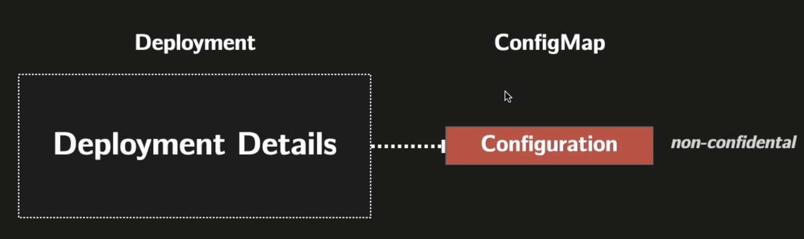
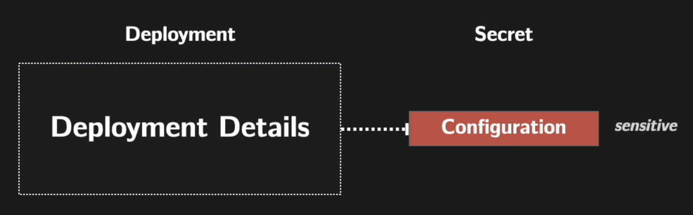

## ConfigMap

ConfigMap is a specialized k8s object to declare a set of key-value pairs (non-confidential).

## Secrets

Secrets are a specialized k8s object to declare a set of key-value pairs (confidential).

Important Note: while Secrets are base64 encoded, they are not encrypted. Additional security measures are typically implemented to protect sensitive data in clusters. These can include external secret management systems, or implementing Kubernetes Encryption Providers. However, specific approaches are beyond the scope of this overview as they vary based on organizational needs and security policies.