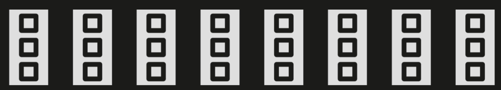
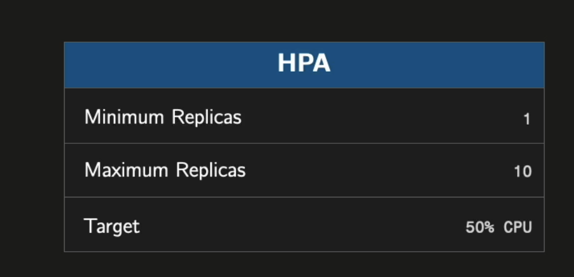

## HPA

HPA stands for Horizontal Pod Autoscaler. It is a Kubernetes feature that automatically scales the number of pods in a deployment or statefulset based on CPU utilization (not on memory), but custom metrics can be used as well.

Autoscaling Behavior: The HPA will increase or decrease the number of replicas to maintain the target CPU utilization.

Scaling Range: The number of pods will be adjusted between 1 and 10 based on the CPU utilization.

Resource Metrics: While this example uses CPU, HPAs can also use memory or custom metrics.

Target Utilization: 50% target utilization is a common starting point, but this can be adjusted based on application needs.

Namespace Scoping: The HPA is namespace-specific, allowing for isolated scaling policies across different parts of your application.

Scaling Algorithm: Kubernetes uses a control loop to periodically adjust the number of replicas based on the observed metrics.

## Metrics Server

HPA relies on the metrics-server to read CPU/memory usage from kubelets. Install and configure it with:

```bash
kubectl apply -f https://github.com/kubernetes-sigs/metrics-server/releases/latest/download/components.yaml && kubectl patch deployment metrics-server -n kube-system --type='json' -p='[{"op": "add", "path": "/spec/template/spec/containers/0/args/-", "value":"--kubelet-insecure-tls"}]'
```

The first part installs the official metrics-server manifest (Deployment, Service, RBAC) in the `kube-system` namespace. The second part patches in the `--kubelet-insecure-tls` flag — required on local clusters (Docker Desktop, minikube) because kubelets there use self-signed certificates that metrics-server would otherwise reject.

Check pod CPU usage once metrics-server is running:

```bash
kubectl top pods -n grade-submission
```




