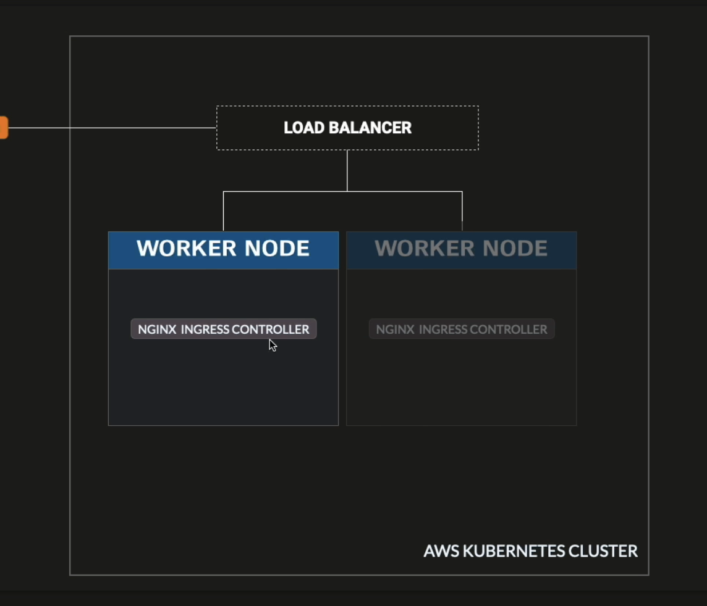
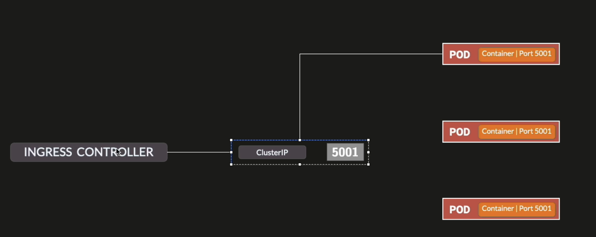
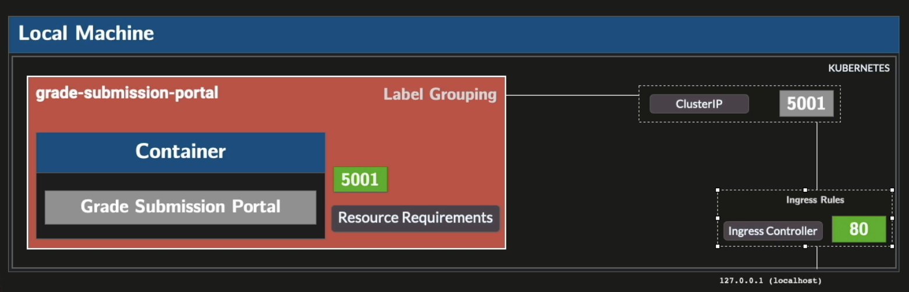

## Goal of this section

We stop using NodePort

We stop using hardcoded IP address

We need to replace NodePort with smth which can scale

When you deploy de AWS, you have access to a oad balancer


## Load Balancer


Load balancer is balancing between worker nodes (= load balancer on a nodes level), but an app itself can scale due to HPA,  so I cannot understand.



Load balancer = reverse proxy. It relues on ingress rules.


Cluster IP is a natural load balancer itself on pod level:



Without AWS, locally, we will have smth like this replcasing NodePort with ClusterIP with Ingress Controller a as a port (final view):




## Installing Ingress Controller

```bash
kubectl apply -f https://raw.githubusercontent.com/kubernetes/ingress-nginx/controller-v1.8.2/deploy/static/provider/cloud/deploy.yaml

#  The controller pod is Running and the two Completed pods are one-time admission webhook setup jobs — that's expected.

$ kubectl get pods -n ingress-nginx
NAME                                        READY   STATUS      RESTARTS   AGE
ingress-nginx-admission-create-2xck6        0/1     Completed   0          6m54s
ingress-nginx-admission-patch-6thlv         0/1     Completed   0          6m54s
ingress-nginx-controller-66cb9865b5-z4v7h   1/1     Running     0          6m54s
```

## Ingress Controller

The Ingress controller in Kubernetes acts as a reverse proxy, which means it sits in front of web servers and acts on their behalf to forward external HTTP requests to the appropriate internal services.


## IPs filtering

### Bits and binary

A **bit** is a single `0` or `1`. Each bit has 2 possible values, and with N bits you multiply the choices together:

```
1 bit:  2                         = 2 values   (0, 1)
2 bits: 2 × 2                     = 4 values   (00, 01, 10, 11)
3 bits: 2 × 2 × 2                 = 8 values   (000, 001, 010, 011, 100, 101, 110, 111)
8 bits: 2 × 2 × 2 × 2 × 2 × 2 × 2 × 2 = 256 values
```

That multiplication is just `2^N` (2 to the power of N — N means "how many times we multiply 2 by itself").

### How an IPv4 address works

An IPv4 address is **32 bits**, split into 4 groups of 8 bits (called octets):

```
192      .  168      .  1        .  0
11000000    10101000    00000001    00000000
```

Each octet is 8 bits → max value `11111111` in binary = `255` in decimal.
That is why IPs go from `0.0.0.0` to `255.255.255.255`.

### CIDR notation: `192.168.1.0/24`

The `/24` means the first 24 bits are **fixed** (the network), and the remaining `32 - 24 = 8` bits are **free** (the host part).

```
fixed (24 bits)                  | free (8 bits)
11000000 . 10101000 . 00000001   | 00000000  → 192.168.1.0
11000000 . 10101000 . 00000001   | 11111111  → 192.168.1.255
```

8 free bits → `2^8 = 256` addresses.

### Common ranges

- `/32` — 0 free bits → `2^0 = 1` IP (exact single address)
- `/24` — 8 free bits → `2^8 = 256` IPs
- `/16` — 16 free bits → `2^16 = 65,536` IPs
- `/8`  — 24 free bits → `2^24 = 16,777,216` IPs

The smaller the suffix, the more free bits, the larger the range.

### In ingress

```yaml
annotations:
  nginx.ingress.kubernetes.io/whitelist-source-range: "10.0.0.0/8,192.168.0.0/16"
```
Requests from IPs outside those ranges get a `403`.
