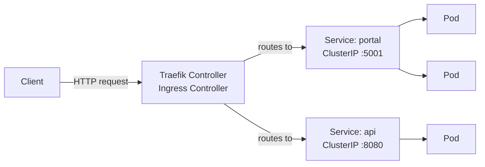
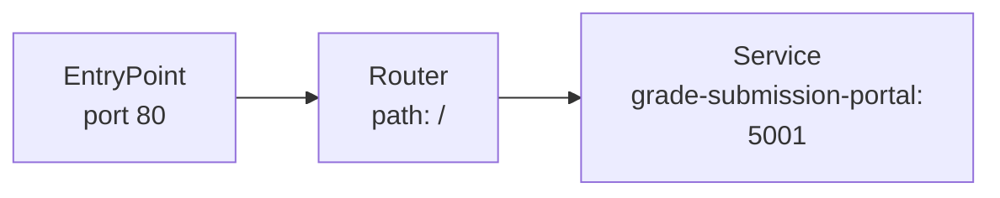
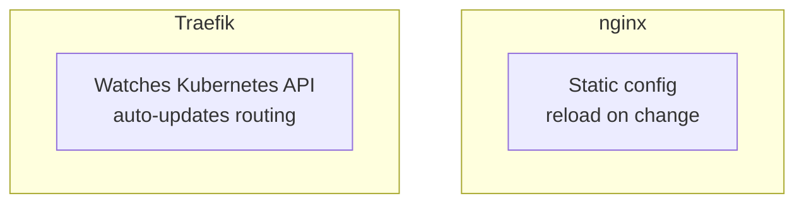
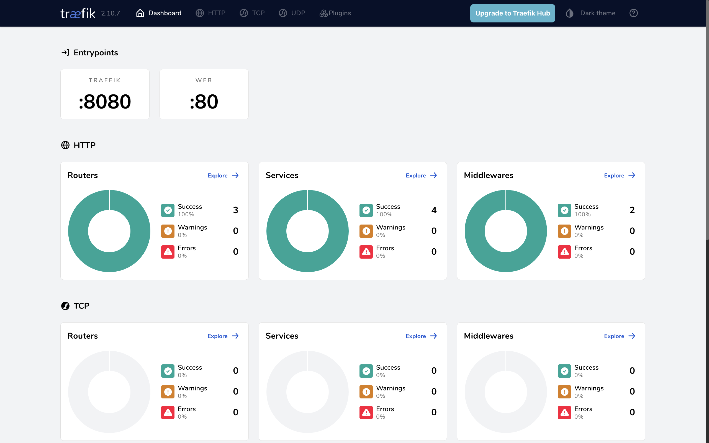

## Traefik

Traefik is an ingress controller and reverse proxy designed for cloud-native environments. Unlike nginx, it auto-discovers services and routes traffic without manual reloads.

### How Traefik fits in the cluster



Traefik watches Kubernetes Ingress resources and automatically updates its routing table when services change.

### Key concepts

**EntryPoint** — the port Traefik listens on (e.g. `web` = port 80, `websecure` = port 443).

**Router** — matches an incoming request (by host, path) and forwards it to a service.

**Service** — the upstream target (maps to a Kubernetes Service).



### Installing Traefik

**Why is this harder than nginx?**
Nginx publishes a single ready-made manifest maintained by their team — one URL, one command. Traefik chose Helm as their primary distribution method and never published an equivalent. So without Helm you write the pieces yourself.

If you want to use Helm (it's just a CLI package manager, no deep knowledge needed):
```bash
brew install helm
helm repo add traefik https://helm.traefik.io/traefik
helm repo update
helm install traefik traefik/traefik --namespace traefik --create-namespace
```

Without Helm, apply the folder directly:
```bash
kubectl apply -f traefik/
```

The `traefik/` folder contains one file per resource:
- `namespace.yaml` — creates the `traefik` namespace
- `serviceaccount.yaml` — identity for the Traefik pod
- `rbac.yaml` — ClusterRole + ClusterRoleBinding (permissions to watch Ingress/Services)
- `deployment.yaml` — runs the Traefik container
- `service.yaml` — exposes Traefik on port 80 (LoadBalancer)
- `ingressclass.yaml` — registers `traefik` as a known class in the cluster

Verify:
```bash
kubectl get pods -n traefik
kubectl get ingressclass
```

Expected output:
```
NAME                       READY   STATUS    RESTARTS   AGE
traefik-<hash>             1/1     Running   0          1m

NAME      CONTROLLER                      AGE
nginx     k8s.io/ingress-nginx            ...
traefik   traefik.io/ingress-controller   ...
```

Both nginx and traefik can run at the same time — each only handles Ingress resources with their own `ingressClassName`.

### Ingress resource with Traefik

`ingressClassName: traefik` tells Kubernetes which controller owns this Ingress.
The annotation sets which entrypoint handles the traffic.

```yaml
apiVersion: networking.k8s.io/v1
kind: Ingress
metadata:
  name: grade-submission-portal-ingress
  namespace: grade-submission
  annotations:
    traefik.ingress.kubernetes.io/router.entrypoints: web
spec:
  ingressClassName: traefik
  rules:
    - http:
        paths:
          - pathType: Prefix
            path: '/'
            backend:
              service:
                name: grade-submission-portal
                port:
                  number: 5001
```

### nginx vs Traefik



- nginx requires a reload when routes change; Traefik does not
- Traefik has a built-in dashboard (`http://localhost:8080/dashboard/`)
- Both implement the standard `networking.k8s.io/v1` Ingress spec

### Start / stop the app

**Stop (removes app only, Traefik keeps running):**
```bash
kubectl delete -f grade-submission-portal/ -f grade-submission-api/ -f mongodb/
```

If you installed the app with Helm, deleting the Kubernetes objects manually does not remove the Helm release record. Helm still thinks the release exists, and future `helm install` commands with the same release name will fail.

**Remove the Helm release too:**
```bash
helm uninstall mongodb -n grade-submission
helm uninstall grade-submission-api -n grade-submission
helm uninstall grade-submission-portal -n grade-submission
```

This is why deleting Deployments, StatefulSets, or Services alone is not enough when a chart was installed with Helm: the release metadata is stored in the cluster, and Helm manages the resources as a set.

**Start:**
```bash
kubectl apply -f grade-submission-portal/
kubectl apply -f grade-submission-api/
kubectl apply -f mongodb/
```

Or, if you want Helm to manage the app again:
```bash
helm upgrade --install grade-submission-api ./grade-submission-api -n grade-submission --create-namespace
helm upgrade --install grade-submission-portal ./grade-submission-portal -n grade-submission --create-namespace
helm upgrade --install mongodb ./mongodb -n grade-submission --create-namespace
```

**Verify:**
```bash
kubectl get pods -n grade-submission
kubectl get ingress -n grade-submission
```

App is available at `http://localhost/`.
Traefik dashboard at `http://localhost:8080/dashboard/`.


---

### IP filtering with Traefik

```yaml
annotations:
  traefik.ingress.kubernetes.io/router.middlewares: grade-submission-ipwhitelist@kubernetescrd
```

Defined as a Middleware CRD:

```yaml
apiVersion: traefik.io/v1alpha1
kind: Middleware
metadata:
  name: ipwhitelist
  namespace: grade-submission
spec:
  ipWhiteList:
    sourceRange:
      - 10.0.0.0/8
      - 192.168.0.0/16
```

Requests from IPs outside those ranges get a `403`.
