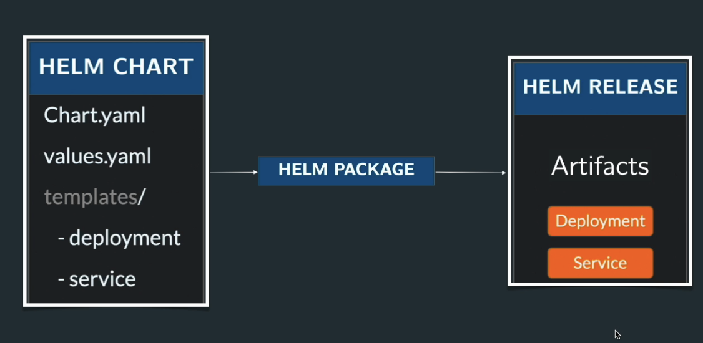

# Grade Submission Helm Charts

This directory contains Helm charts for deploying the grade submission application and MongoDB on Kubernetes.

Everything can be managed by Helm package manager.




## Charts Included

### 1. grade-submission-api
Helm chart for the grade submission API backend service.

**Features:**
- 3 replicas by default with rolling update strategy
- Configurable image, resources, and health probes
- ConfigMap and Secret for environment variables
- Liveness and readiness probes for reliability

**Install:**
```bash
helm install grade-submission-api ./grade-submission-api -n grade-submission --create-namespace
```

**Customize values:**
```bash
helm install grade-submission-api ./grade-submission-api -n grade-submission --create-namespace --set replicaCount=2 --set image.tag=stateless-v2
```

### 2. grade-submission-portal
Helm chart for the grade submission frontend portal.

**Features:**
- 1 replica by default
- Configurable image and resources
- Optional ConfigMap for environment variables

**Install:**
```bash
helm install grade-submission-portal ./grade-submission-portal -n grade-submission --create-namespace
```

### 3. mongodb
Helm chart for MongoDB StatefulSet.

**Features:**
- StatefulSet for persistent storage
- 1Gi persistent volume by default
- Configurable storage size and credentials

**Install:**
```bash
helm install mongodb ./mongodb -n grade-submission --create-namespace
```

## Deploying All Charts

Deploy all three charts together:

```bash
helm install grade-submission-api ./grade-submission-api -n grade-submission --create-namespace
helm install grade-submission-portal ./grade-submission-portal -n grade-submission
helm install mongodb ./mongodb -n grade-submission
```

Or using a values file for each:

```bash
helm install -f values-api.yaml grade-submission-api ./grade-submission-api -n grade-submission --create-namespace
helm install -f values-portal.yaml grade-submission-portal ./grade-submission-portal -n grade-submission
helm install -f values-mongodb.yaml mongodb ./mongodb -n grade-submission
```

## Ingress Controller

To expose the portal on `localhost`, install an Ingress controller in your cluster first. For NGINX:

```bash
helm repo add ingress-nginx https://kubernetes.github.io/ingress-nginx && helm repo update && helm install ingress-nginx ingress-nginx/ingress-nginx --namespace ingress-nginx --create-namespace
```

Then deploy or upgrade the portal chart:

```bash
helm upgrade --install grade-submission-portal ./grade-submission-portal -n grade-submission --create-namespace
```

After the controller is running, the portal should be reachable at `http://localhost/` if your local cluster supports host-based ingress.

## Listing Deployments

```bash
# List all releases
helm list -n grade-submission

# Get detailed info about a release
helm status grade-submission-api -n grade-submission
```

## Upgrading

```bash
helm upgrade grade-submission-api ./grade-submission-api -n grade-submission --set replicaCount=5
```

## ConfigMap updates and rollout behavior

If you change a ConfigMap used by a Deployment, Kubernetes does not restart existing pods automatically. The pod only receives updated environment variables when it starts.

In this chart we force a rollout by adding a checksum annotation to the pod template metadata. When the rendered Helm template changes, the Deployment spec changes, and Kubernetes creates new pods:

- Helm renders templates and computes the final manifest.
- `helm upgrade` compares the new manifest against the current release.
- A changed pod template annotation causes the Deployment controller to perform a rolling update.
- New pods start with the updated ConfigMap values.

This is a standard Helm/Kubernetes pattern for ConfigMaps used as environment variables.

Learn more:
- Kubernetes ConfigMap docs: https://kubernetes.io/docs/concepts/configuration/configmap/
- Kubernetes Deployment rollout docs: https://kubernetes.io/docs/concepts/workloads/controllers/deployment/
- Helm upgrade docs: https://helm.sh/docs/helm/helm_upgrade/
- Helm template functions: https://helm.sh/docs/chart_template_guide/functions_and_pipelines/

## Uninstalling

```bash
helm uninstall grade-submission-api -n grade-submission
helm uninstall grade-submission-portal -n grade-submission
helm uninstall mongodb -n grade-submission
```

## Chart Structure

Each chart contains:
- **Chart.yaml** - Chart metadata
- **values.yaml** - Default configuration values
- **templates/deployment.yaml** or **templates/statefulset.yaml** - Main workload resource
- **templates/service.yaml** - Kubernetes Service
- **templates/config.yaml** or **templates/secret.yaml** - Configuration and secrets
- **templates/_helpers.tpl** - Template helpers and functions

## Customization

Edit `values.yaml` in each chart directory to customize:
- Replicas and resource limits
- Image versions and repositories
- Environment variables (ConfigMap and Secrets)
- Storage size (for MongoDB)
- Service ports and types

## Namespace

All charts are configured to deploy to the `grade-submission` namespace. Update the `namespace` value in `values.yaml` to deploy to a different namespace.
