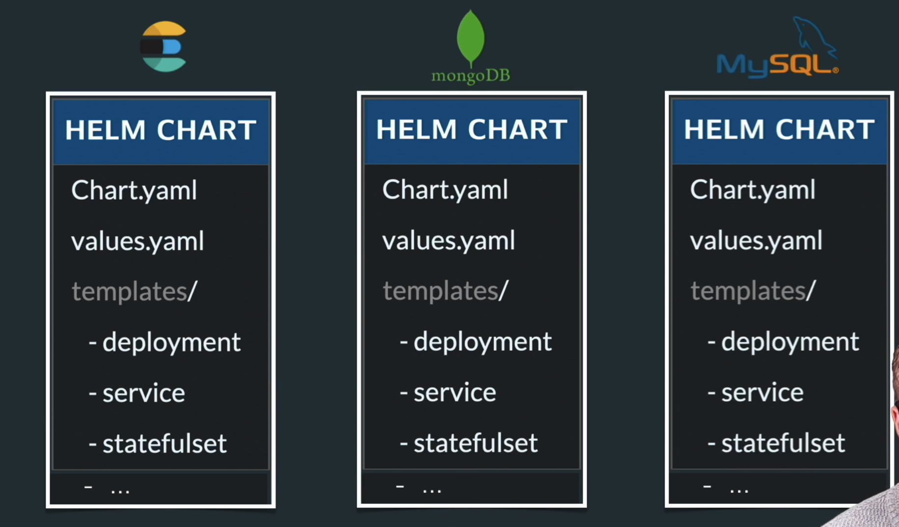

# Grade Submission Helm Charts

This directory contains Helm charts for deploying the grade submission application and MongoDB on Kubernetes.

Everything can be managed by Helm package manager.

## Chart Structure

Each chart contains:
- **Chart.yaml** - Chart metadata
- **values.yaml** - Default configuration values
- **templates/deployment.yaml** or **templates/statefulset.yaml** - Main workload resource
- **templates/service.yaml** - Kubernetes Service
- **templates/config.yaml** or **templates/secret.yaml** - Configuration and secrets
- **templates/_helpers.tpl** - Template helpers and functions

## Customization

Edit `values.yaml` in each chart directory to customize:
- Replicas and resource limits
- Image versions and repositories
- Environment variables (ConfigMap and Secrets)
- Storage size (for MongoDB)
- Service ports and types

## Namespace

All charts are configured to deploy to the `grade-submission` namespace. Update the `namespace` value in `values.yaml` to deploy to a different namespace.

Helm can be trated as npm, it provides you packages for multiple products:

## Deploying All Charts
[here](./chart_deployment.md)

## Packaging a chart
[here](./chart_packaging.md)

## Traefik Ingress Controller
[here](./traefik_ingress.md)

## Listing Deployments
[here](./listing_deployments.md)

## Upgrading
[here](./upgrading.md)

## ConfigMap updates and rollout behavior
[here](./configmap_rollout.md)

## Uninstalling
[here](./uninstalling.md)

## Helm repos access
[here](./helm_update_command.md)
