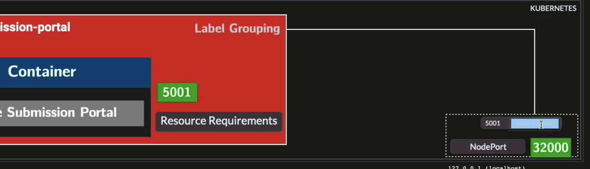
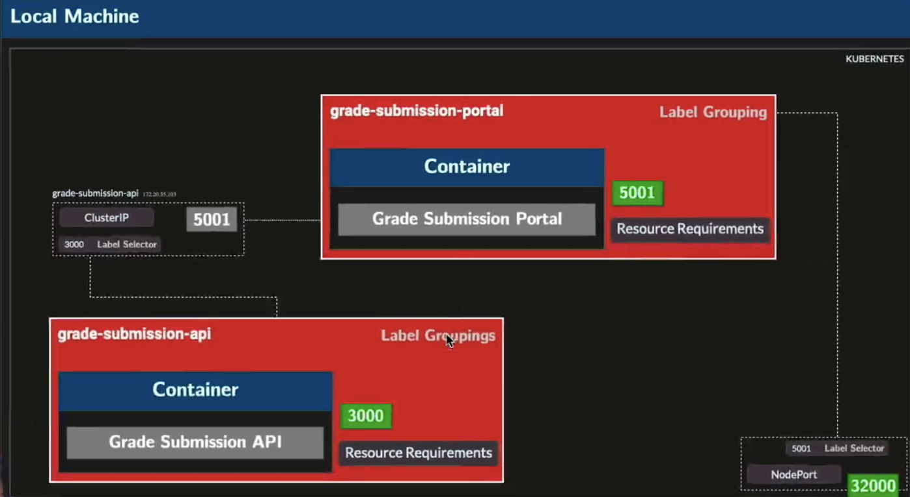

## NodePort

Exposes the Service on a static port (30000–32767) on **every Node** in the cluster.
External traffic reaches the app via `<NodeIP>:<nodePort>`.

- The Service also gets a cluster-internal IP, so it's reachable both externally and internally.
- Use case: development, quick demos, or when you don't have a cloud load balancer.
- Traffic flow: `External client → NodeIP:nodePort → Service → Pod:targetPort`

```yaml
spec:
  type: NodePort
  ports:
    - port: 5001        # internal cluster port
      targetPort: 5001  # port the container listens on
      nodePort: 32000   # externally accessible port on each Node
```

## ClusterIP

Exposes the Service on an **internal IP only** — reachable solely within the cluster.
This is the default Service type if `type` is omitted.

- No external access. Pods talk to each other using the Service name as DNS (e.g. `grade-submission-api:8080`).
- Use case: internal communication between microservices (e.g. portal → API).
- Traffic flow: `Pod → ClusterIP:port → Service → Pod:targetPort`

```yaml
spec:
  type: ClusterIP       # or omit — this is the default
  ports:
    - port: 8080        # internal cluster port other Pods call
      targetPort: 8080  # port the container listens on
```





